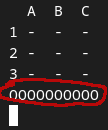

# TicTacToe
## How to play
1. Run the Game
2. type the cooridantes to place your token (e.g. `a1` or `b3`) 
## Rules
The Player, who has an diagonal, horizontal or vertical line of 3 wins
## Info
You can see the current token here:
 

